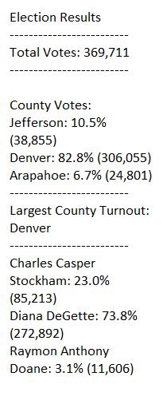

# Election_Analysis

## Project Overview
A  task is given to complete the election audit of a recent local congressional election.

1. Calculate the total number of votes to cast.
2. Get the complete list of candidates who received votes.
3. Calculate the total number of votes each candidate received.
4. Calculate the percentage of votes each candidate won.
5. Determine the winner of the election based on popular vote.
6. Get the complete list of counties that received votes.
7. Calculate the total number of votes cast from each county.
8. Calculate the percentage of votes cast from each county.
0. Determine which county had the largest voter turnout.
 

## Election-Audit Results
The analysis of the election show that:
- There were 369,711 votes casted in the election.
```diff
   - The candidates were:
+  - Charles Casper Stockham 
!  - Diana DeGette
- - Raymon Anthony Doane
```

- The candidate results were:
  ```diff 
  + - Charles Casper Stockham received 23.0% of the vote with 85,213 votes.
   
  !- Diana DeGette received 73.8% of the vote with 272,892 votes.
 
  - - Raymon Anthony Doane received 3.1% of the vote 11,606 votes.
  ```
- The winner of the election was:
  - Diana DeGette received 73.8% of the vote with 272,892 votes.
  - The voters are from the following counties:
  - Jefferson County
  - Denver County
  - Arapahoe County
- The voter breakdown by county was:
  - Jefferson county cast 10.5% of the vote with 38,855 votes.
  - Denver county cast 82.8% of the vote with 306,055 votes.
  - Arapahoe county cast 6.7% of the vote with 24,801 votes.
- The Largest county voter turnout:
  - Denver county cast 82.8% of the vote with 306,055 votes
  
  
  
## Election - Audit Summary
This scipt can be used for any future election to get the results and visualize it according to the user. This code provided information on winning candidates and voter turnout by the county, the scipt can be modifed to call other election datafields. We can determine election results in any format , like based on gender or age . In addition to capturing different datafields, we can modify the output to give us a different resutls message. We can also set the format of the data to be visualized .

## Resources used
- Data Source: election_results.csv
- Software: Python 3.7.6
- Visual Studio Code
- Google support for reviewing the code 
- Terminal command prompt
